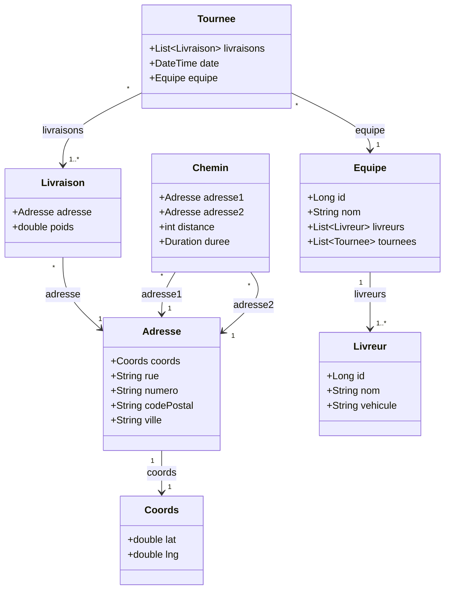

# Backend

## Database Class Diagram

```mermaid
classDiagram
    class Coords {
        +double lat
        +double lng
    }

    class Adresse {
        +Coords coords
        +String rue
        +String numero
        +String codePostal
        +String ville
    }

    class Livraison {
        +Adresse adresse
        +double poids
    }

    class Tournee {
        +List~Livraison~ livraisons
        +DateTime date
        +Equipe equipe
    }

    class Equipe {
        +Long id
        +String nom
        +List~Livreur~ livreurs
        +List~Tournee~ tournees
    }

    class Livreur {
        +Long id
        +String nom
        +String vehicule
    }

    class Chemin {
        +Adresse adresse1
        +Adresse adresse2
        +int distance
        +Duration duree
    }

    Adresse "1" --> "1" Coords : coords
    Livraison "*" --> "1" Adresse : adresse
    Tournee "*" --> "1..*" Livraison : livraisons
    Tournee "*" --> "1" Equipe : equipe
    Equipe "1" --> "1..*" Livreur : livreurs
    Chemin "*" --> "1" Adresse : adresse1
    Chemin "*" --> "1" Adresse : adresse2
```
